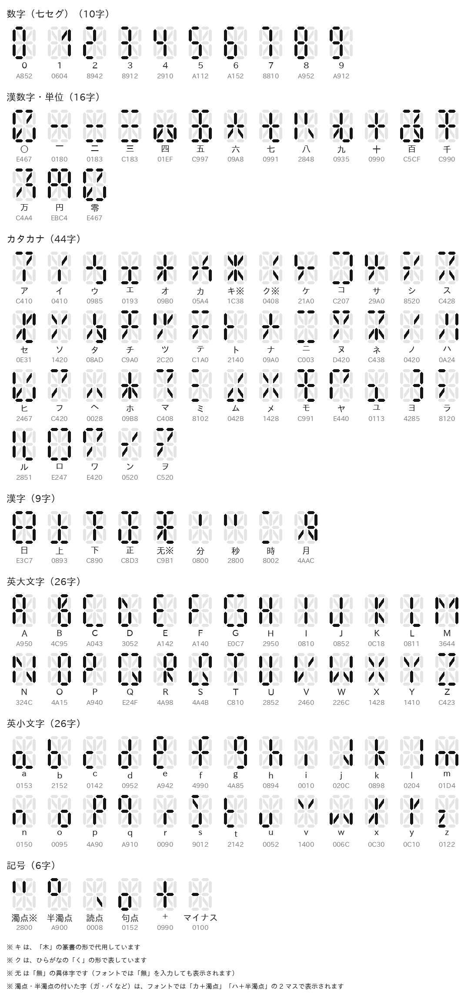
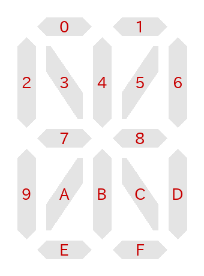
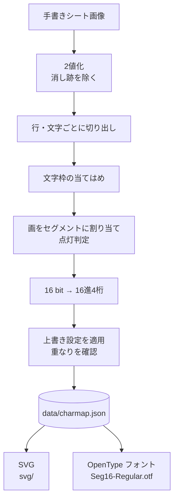

# 16segmen_font

漢数字をデジタル表示する仕組みを、パソコンで使えるフォントにしたものです。

## コンセプト

デジタル時計のアラビア数字は、「日」の字の形に並んだ 8 本のセグメントの点灯・消灯で表示されます。
この仕組みを、イギリス国旗のように「米」の字に「田」の字を重ねた形に並べた 16 本のセグメントへ広げると、
漢数字やカタカナ、簡単な漢字まで表示できます。
こうして作った字形を、ついでにパソコン用のフォント（`Seg16-Regular.otf`）にしました。



## 作り方の流れ

### PART1 記号化 ― 手書きの字形を数値にする

1. 16 セグメントを 5×5 の行列に当てはめます。四隅や上下の中央など、セグメントが無いマスは使いません（マスク）。
   手書きの画像を読み込み、セグメントごとに点灯（1）・消灯（0）を記録します。
2. 16 本のセグメントに、位置に応じて 0〜F の番号を振り、行列を 16 桁の 2 進数に変換します。
3. 2 進数を 16 進数 4 桁にし、「文字：16 進数」の対照リストとして保存します。

当初は番号を 1〜9・A〜G としていましたが、16 進数 1 桁とそのまま対応するよう 0〜F にしました。

### PART2 復号 ― 数値から字形を描く

1. 逆の手順で、対照リストの数値から文字ごとの行列を作ります。
2. 行列から SVG を描きます。セグメントは 1 本ずつ、表示器のセグメントらしい形にします。
3. 最初の手書き画像と SVG が一致しているかを確かめます。

3 の確認は、AI による自動判別ではなく、手書きと読み取り結果を並べた確認シート（`scripts/review.py`）を人が見て行いました。
読み違いは上書き設定（`data/overrides.json`）で直しています。

### PART3 OTF 化 ― フォントにする

各文字の字形から OpenType フォント（OTF）を作ります。
輪郭は SVG と同じセグメント形状から作るので、SVG とフォントの見た目は一致します。

## 収録文字（67 字）

| 分類 | 字数 | 文字 |
|---|---|---|
| 数字・単位 | 15 | 一 二 三 四 五 十 千 円 六 七 八 九 〇 百 万 |
| カタカナ | 44 | ア イ ウ エ オ カ キ ク ケ コ サ シ ス セ ソ タ チ ツ テ ト ナ ニ ヌ ネ ノ ハ ヒ フ ヘ ホ マ ミ ム メ モ ヤ ユ ヨ ラ ル ロ ワ ン ヲ |
| 漢字 | 8 | 日 上 下 正 无 分 秒 時 |

フォントでは、次の文字も同じ字形で表示されます。

| 入力 | 表示される字形 |
|---|---|
| アラビア数字 `0`〜`9`、全角数字 `０`〜`９` | 漢数字 〇 一 二 三 四 五 六 七 八 九 |
| ひらがな（あ〜ん、を） | 対応するカタカナ（ア〜ン、ヲ） |

例えば「12時30分」と「一二時三〇分」、「あいう」と「アイウ」は同じ表示になります。
空白（U+0020）も収録しています。

> [!WARNING]
> **記号には対応していません。** `:` `'` `"` `-` `.` `,` `/` などの記号、句読点（`、` `。`）、長音符（`ー`）、
> アルファベット、濁点・半濁点付きの字（`ガ` `パ` など）、小書きの字（`ッ` `ャ` など）は収録していません。
> これらは全セグメント点灯の字形（`.notdef`）で表示されます。
> 分・秒・時 の字形は `'` `"` `:` に似ていますが、記号の文字コードには割り当てていないので、
> 時刻を表示するときは「12時30分」のように漢字で入力してください。

- 分・秒・時 は、時刻表示用の記号に近い字形です（分＝`'`、秒＝`"`、時＝`:` に相当）
- 二（漢数字）とニ（カタカナ）、三とミは、同じ点灯パターンにならないよう字形を変えています

## セグメントの番号と符号化



16 本のセグメントに 0〜F の番号を振り、5×5 の行列に配置します（`.` はセグメントの無いマス）。

```
.  0  .  1  .
2  3  4  5  6
.  7  .  8  .
9  A  B  C  D
.  E  .  F  .
```

点灯しているセグメントを 1 とする 16 bit の整数にし、16 進 4 桁で表します。
セグメント 0 を最上位ビット（`0x8000`）、F を最下位ビット（`0x0001`）とします。

例: 一 ＝ 中段の横棒 7 と 8 ＝ `0000 0001 1000 0000` ＝ `0180`

対照表は [data/charmap.json](data/charmap.json)（`{"文字": "16進4桁"}`）です。

## 記号化の詳細（手書きの読み取り）

PART1 の、手書き画像から対照表を作る処理の流れです。



1. **2値化**: 薄いしきい値でつながる領域のうち、濃い画素を含むものだけをインクとします（ヒステリシス2値化）。
   鉛筆の消し跡のような薄い線を除けます。
2. **切り出し**: 行は、横方向の濃淡のインク区間を大きい隙間から行数ぶん切ります。
   文字は、行内の画の塊を左から順に、指定した文字数ちょうどに分けます。
   字の幅が標準幅に近く、切れ目の隙間が広い分け方を動的計画法で選ぶので、
   画どうしが離れた字（八）や、枠の片側だけに描かれた狭い字（イ・ク）も分けられます。
3. **文字枠の当てはめ**: 手書きの外接矩形は 16 セグの枠と一致するとは限りません。
   枠の位置と大きさを探索し、インクの各画素が「同じ向きのセグメントの線分」の近くにあるほど高い点を与えます。
   画の向きは構造テンソルで求めます。斜めの画は必ず枠の中心を通るので、位置の手がかりになります。
4. **点灯判定**: インクの各画素を、向きと位置が最も合うセグメントに割り当てます。
   割り当てられた画の長さが、セグメントの長さの 18% 以上なら点灯とします。短い画でも、その位置と向きに描かれていれば点灯します。
5. **符号化**: 点灯セグメントの集合を 16 bit の整数にし、16 進 4 桁で対照表に記録します。
6. **上書き**: [data/overrides.json](data/overrides.json)（`{"文字": "点灯セグメント番号の列挙"}`）を、読み取り結果より優先して適用します。
   手書きの読み違いの修正や、字形どうしの重なりを避けるためのデザイン変更に使います。値を `null` にした文字は対照表から外します。
   同じ点灯パターンの文字ができると警告します。

SVG とフォントのセグメントは、両端を尖らせた六角形（縦横）と、先端を水平・垂直に切った帯（斜め）です。
縦横どうしの隙間と、斜めと周りの隙間は別々に調整できます（`seg16/svg.py` の `Style`）。

## 使い方

Python 3.13、Pillow、NumPy、OpenCV（`opencv-python`）、fontTools を使います。

```bash
python -m unittest                # テスト
python scripts/decode.py          # 対照表から svg/<文字>.svg と svg/index.html を生成
python scripts/build_font.py      # 対照表から Seg16-Regular.otf を生成
python scripts/render_docs.py     # README 用の画像 docs/segments.png・docs/charmap.png を生成
```

### 手書き画像から対照表を作り直す

手書き画像はリポジトリに含めていません。自分で用意した画像から読み取るときは、
シート定義 `data/<名前>_sheet.json` を作ります。

```json
{
  "image": "samples/my_sheet.jpg",
  "crop": [320, 90, 1070, 1840],
  "rows": ["アイウエオ", "ヤ_ユ_ヨ"],
  "bands": [[90, 272], [1344, 1486]],
  "segments": {"ア": "015B"}
}
```

| キー | 必須 | 内容 |
|---|---|---|
| `image` | ○ | 画像のパス（リポジトリからの相対パス） |
| `rows` | ○ | 行ごとの文字列。左から順に並べる。`_` は空きマス |
| `crop` | | 読み取る範囲 `[x0, y0, x1, y1]`。見出しや罫線を除くときに使う |
| `bands` | | 行ごとの縦の範囲。自動で分けられないときに指定する。隣の行と画を共有する字は範囲を重ねる |
| `segments` | | 正解（点灯セグメント番号の列挙）。読み取り結果の回帰確認に使う |

```bash
python scripts/review.py data/my_sheet.json -o out/review.png   # 手書きと読み取り結果を並べた確認シート
python scripts/evaluate.py data/my_sheet.json                    # 正解 segments と照合
python scripts/encode.py                                         # data/*_sheet.json をすべて読み、data/charmap.json を生成
```

確認シートでは、判定がしきい値に近い字や、どのセグメントにも当てはまらないインクが多い字に赤枠が付きます。
読み違いは `data/overrides.json` で直します。

## ファイル構成

| パス | 内容 |
|---|---|
| `Seg16-Regular.otf` | 生成したフォント（CFF、等幅） |
| `data/charmap.json` | 対照表 `{文字: 16進4桁}` |
| `data/overrides.json` | 上書き設定 `{文字: 点灯セグメント番号の列挙}` |
| `svg/` | 文字ごとの SVG と一覧ページ `index.html` |
| `docs/` | README 用の画像 |
| `seg16/layout.py` | セグメントの配置定義 |
| `seg16/codec.py` | セグメント集合・5×5 行列・16 bit・16 進の相互変換 |
| `seg16/segment.py` | 2値化と、行・文字の切り出し |
| `seg16/fit.py` | 文字枠の当てはめと、セグメントへの割り当て |
| `seg16/recognize.py` | 画の向きの推定と、行内の予想枠 |
| `seg16/pipeline.py` | 手書きシートの読み取り |
| `seg16/charmap.py` | 上書きの適用と重なりの確認 |
| `seg16/svg.py` | セグメント形状と SVG の描画 |
| `seg16/font.py` | OpenType フォントの生成 |
| `scripts/` | 上記を呼び出すコマンド |
| `tests/` | テスト（`python -m unittest`） |

## ライセンス

フォント・プログラム・画像を含むリポジトリ全体を [MIT License](LICENSE) で公開します。
利用・改変・再配布・商用利用は自由です。再配布するときは、著作権表示（`Copyright (c) 2026 uzuki-sae`）と
ライセンス文を残してください。
